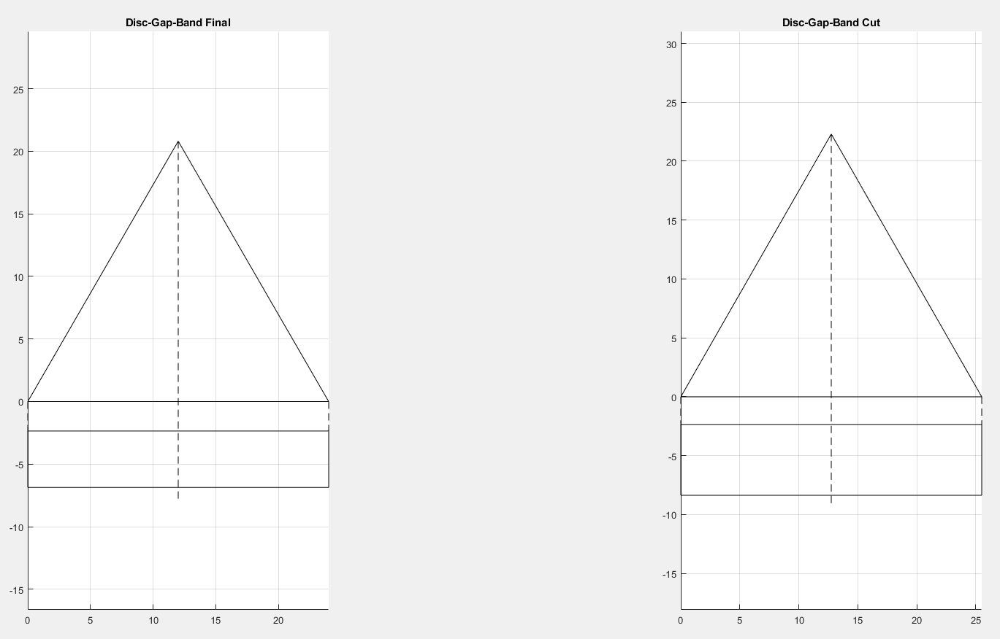

# Zephyr-Parachute-Model

## Description
This is a small script for Project Zephyr. It creates a 2D representation of a parachute gores in both cut and final configurations. Designed to help members better visualize gore patterns between different configurations.

## Screenshot

## Future Roadmap
No further plans at this moment. This project may be revisted if zephyr requires further development. 

